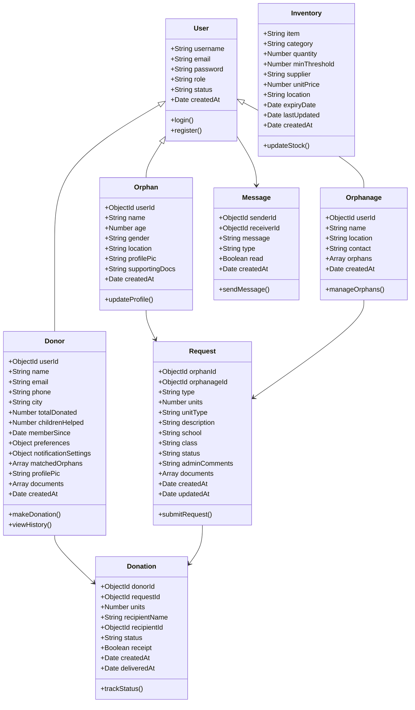
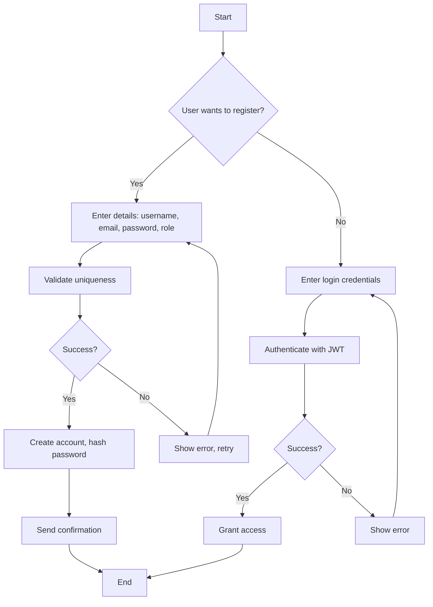
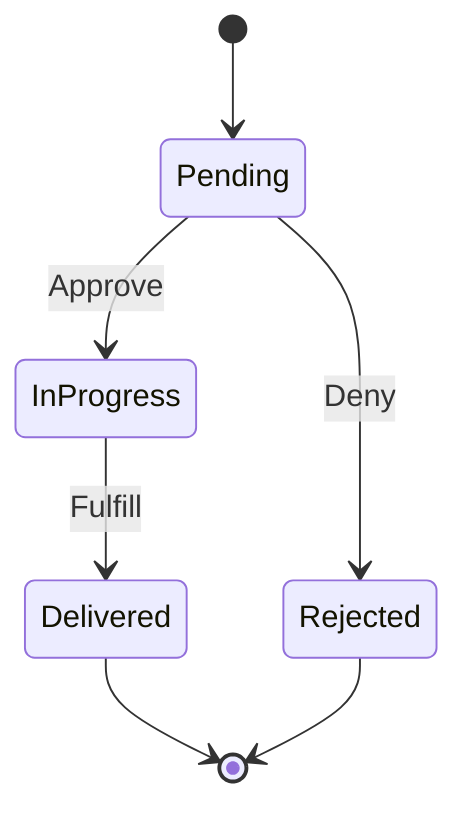
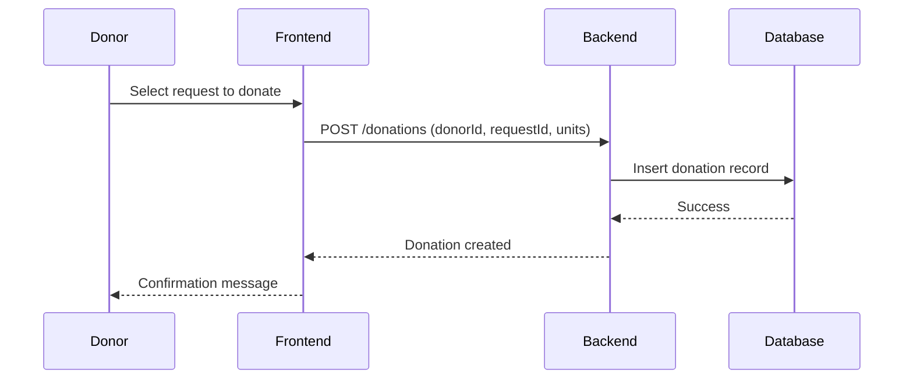

# Chapter 4: Design Specification

## 4.4.1 High Fidelity Prototype

This section presents high-fidelity prototypes of the Hope4All application's user interface. These mockups and screenshots illustrate the key screens and user interactions, designed to provide a realistic representation of the final product. The prototypes were created using tools like Figma or Adobe XD, focusing on usability, accessibility, and alignment with the requirements specification.

### Key Mockups and Screenshots

1. **Login Screen**
   - Description: A clean login form with fields for email and password, role selection (Donor, Volunteer, Orphanage Staff, Admin), and options for "Remember Me" and "Forgot Password." Includes social login buttons for Google and Facebook. The background features a subtle image related to child welfare.
   - Screenshot Placeholder: [Insert screenshot of Login Screen here]

2. **Donor Dashboard**
   - Description: After login, donors see an overview of their donations, matched orphans, and recent activities. Includes cards for total donated amount, number of children helped, and quick actions like "Make a Donation" or "View Profile." Navigation bar at the bottom for easy access to other sections.
   - Screenshot Placeholder: [Insert screenshot of Donor Dashboard here]

3. **Orphan Profile Management (Orphanage Staff View)**
   - Description: A form to register or edit orphan details, including name, age, gender, location, profile picture upload, and supporting documents. Displays a list of registered orphans with search and filter options. Includes buttons for editing, deleting, or viewing detailed profiles.
   - Screenshot Placeholder: [Insert screenshot of Orphan Profile Management here]

4. **Donation Tracking**
   - Description: A detailed view of donation history, showing status (pending, in-progress, delivered), recipient details, and receipts. Allows donors to upload receipts and view impact reports. Includes charts for visualizing donation trends.
   - Screenshot Placeholder: [Insert screenshot of Donation Tracking here]

5. **Messaging Interface**
   - Description: A chat-like interface for communication between users (e.g., donor to orphanage staff). Displays message threads, with options to send text, images, or files. Includes read receipts and timestamps.
   - Screenshot Placeholder: [Insert screenshot of Messaging Interface here]

6. **Inventory Management**
   - Description: A table or card view of inventory items, showing quantity, category, supplier, and alerts for low stock. Includes forms to add new items, update quantities, and generate reports.
   - Screenshot Placeholder: [Insert screenshot of Inventory Management here]

7. **Request Handling**
   - Description: A list of requests from orphanages, with details like type (e.g., school fees, stationery), status, and admin comments. Allows admins or donors to approve, reject, or fulfill requests.
   - Screenshot Placeholder: [Insert screenshot of Request Handling here]

These prototypes ensure the UI/UX is intuitive, responsive across devices (mobile and web), and adheres to design principles like consistency, feedback, and error prevention.

## 4.5 4+1 View Model of Architecture

The 4+1 View Model provides a comprehensive architectural description of the Hope4All system from multiple perspectives. This model includes logical, process, development, and physical views, with use cases as the unifying "+1" element. Diagrams are represented using Mermaid syntax for clarity.

### 4.5.1 Logical View (Class Diagram)

The logical view describes the system's key classes, their attributes, and relationships, focusing on the problem domain.



### 4.5.2 Process View (Activity Diagram, State Diagram, Sequence Diagram)

The process view illustrates the dynamic behavior of the system, including workflows and interactions.

#### Activity Diagram: User Registration and Login Process


#### State Diagram: Donation Status


#### Sequence Diagram: Making a Donation


### 4.5.3 Development View (Component Diagram)

The development view shows the system's organization into modules and components.

```mermaid
graph TD
    A[Frontend (Flutter)] --> B[Auth Service]
    A --> C[Donor Service]
    A --> D[Orphan Service]
    A --> E[Messaging Service]

    F[Backend (Node.js/Express)] --> G[Auth Controller]
    F --> H[Donor Controller]
    F --> I[Orphan Controller]
    F --> J[Message Controller]
    F --> K[Inventory Controller]
    F --> L[Request Controller]

    M[Database (MongoDB)] --> N[User Model]
    M --> O[Donor Model]
    M --> P[Orphan Model]
    M --> Q[Donation Model]
    M --> R[Request Model]
    M --> S[Message Model]
    M --> T[Inventory Model]

    U[Cloud Storage (Cloudinary)] --> V[File Upload Middleware]

    G --> N
    H --> O
    I --> P
    J --> S
    K --> T
    L --> R
    F --> M
    F --> U
```

### 4.5.4 Physical View (Deployment Diagram)

The physical view depicts the system's hardware and software deployment.

```mermaid
graph TD
    A[User Devices (Mobile/Web)] --> B[Internet]
    B --> C[Load Balancer]
    C --> D[Application Server 1 (Node.js)]
    C --> E[Application Server 2 (Node.js)]
    D --> F[MongoDB Primary]
    E --> F
    F --> G[MongoDB Replica 1]
    F --> H[MongoDB Replica 2]
    D --> I[Cloudinary API]
    E --> I
    I --> J[Cloud Storage]
```

## 4.6 Entity Relationship Diagram

The Entity Relationship (ER) Diagram illustrates the relationships between key entities in the Hope4All system, based on the database models.

```mermaid
erDiagram
    USER ||--o{ DONOR : "has"
    USER ||--o{ ORPHAN : "has"
    USER ||--o{ ORPHANAGE : "has"
    DONOR ||--o{ DONATION : "makes"
    ORPHAN ||--o{ REQUEST : "submits"
    ORPHANAGE ||--o{ REQUEST : "manages"
    REQUEST ||--o{ DONATION : "fulfills"
    USER ||--o{ MESSAGE : "sends/receives"
    INVENTORY ||--o{ REQUEST : "supplies"

    USER {
        string username PK
        string email UK
        string password
        string role
        string status
        date createdAt
    }

    DONOR {
        objectId userId FK
        string name
        string email UK
        string phone
        string city
        number totalDonated
        number childrenHelped
        date memberSince
        object preferences
        object notificationSettings
        array matchedOrphans FK
        string profilePic
        array documents
        date createdAt
    }

    ORPHAN {
        objectId userId FK
        string name
        number age
        string gender
        string location
        string profilePic
        string supportingDocs
        date createdAt
    }

    ORPHANAGE {
        objectId userId FK
        string name
        string location
        string contact
        array orphans FK
        date createdAt
    }

    DONATION {
        objectId donorId FK
        objectId requestId FK
        number units
        string recipientName
        objectId recipientId FK
        string status
        boolean receipt
        date createdAt
        date deliveredAt
    }

    REQUEST {
        objectId orphanId FK
        objectId orphanageId FK
        string type
        number units
        string unitType
        string description
        string school
        string class
        string status
        string adminComments
        array documents
        date createdAt
        date updatedAt
    }

    MESSAGE {
        objectId senderId FK
        objectId receiverId FK
        string message
        string type
        boolean read
        date createdAt
    }

    INVENTORY {
        string item PK
        string category
        number quantity
        number minThreshold
        string supplier
        number unitPrice
        string location
        date expiryDate
        date lastUpdated
        date createdAt
    }
